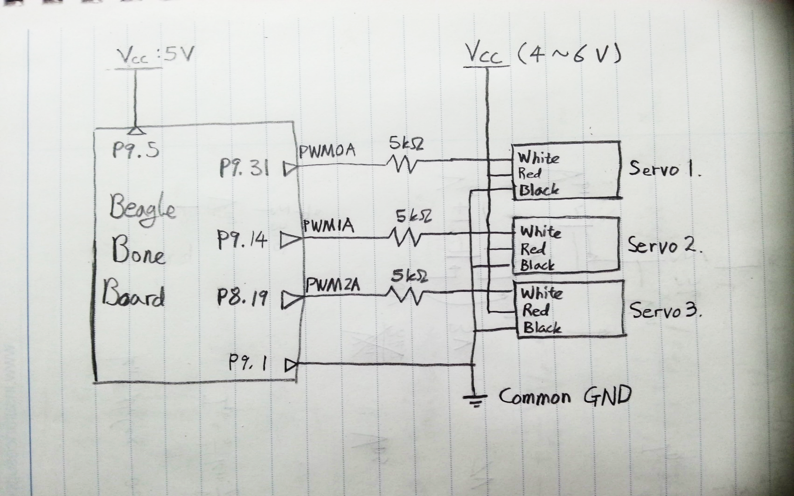
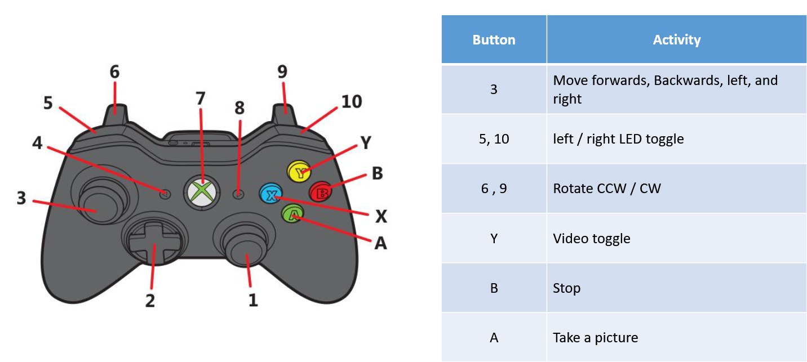

# Exploration Robot
[For more information](https://awsong.000webhostapp.com/project/exploration_robot.html)

## Table of Contents
*   [Key Words](#toc_key)
*   [What is Exploration Robot?](#toc_whatis)  
*   [Layout](#toc_layout)
*   [Details](#toc_details)
    *   [Servos](#toc_servos)
    *   [Wi-Fi](#toc_wifi)
    *   [Camera](#toc_camera)
    *   [Xbox Controller](#toc_xbox)
*   [Language/Software used](#toc_lan)
*   [Hardware used](#toc_hard)
*   [Link](#toc_link)

<a name="toc_key"/>

## Key Words

BeagleBone, Linux, C, C++, Multithreaded Programming, Socket Programming, UDP, SDL2, Python, Makefile, Shell script, TMR, PWM, real time

<a name="toc_whatis"/>

## What is Exploration Robot?

Exploration Robot is a robot that goes to extreme environments that human cannot go to like places exposed to radiation and too small for people. It then gathers information such as video (real-time), temperature, and light intensity, of the area and send it to the base station.

Top view of Exploration Robot

Bottom view of Exploration Robot

Exploration Robot consists of BeagleBone (runs Ubuntu), Logitech C110 camera, photoresistor, temperature sensor, Wi-Fi dongle, 3 servos, 3 omni wheels, 2 Li-Po Batteries, and DC/DC Converter.

The robot is connected to base station via Wi-Fi and is controlled by a wireless Xbox controller.

The robot’s camera sends the video in real time to the base station, which displays the video on a SDL window. You can also save an image by pressing A button on the Xbox controller.

Information such as temperature and light intensity is shown in base station’s terminal.

<a name="toc_layout"/>

## Layout

  

**commander3.cpp** (2 threads): Deals with external commands (Xbox controller), send commands to the robot via UDP, receives images from the robot and displays them in real time, and displays sensor information.

**Send_UDPs.c**: Send images to the base station via UDP every 1 second.

**Capture2.c**: Captures images

**Control_TMR_Bone.c**: Receives commands from base station via UDP and controls the robot’s movement accordingly.

<a name="toc_details"/>

## Details

<a name="toc_servos"/>

### Servos

  

The servos are controlled via PWM signals generated by the BeagleBone. Each servo’s dead band was measured and recorded as below:

Controlled by:

*   Control_TMR_Bone.c

<a name="toc_wifi"/>

### Wi-Fi

A Wi-Fi dongle is connected to the BeagleBone’s USB slot. Then, WPA is setup for the security. After configuring the interface file, the WiFi-driver is manually started.

The base station and the robot communicate via UDP/IP.

The system uses two different ports for the communication: one for controlling servo and one for receiving video and images

Socket programming in C and C++ are used for this purpose.

Used in:

*   commander3.cpp
*   Send_UDPs.c
*   Control_TMR_Bone.c

<a name="toc_camera"/>

### Camera

Logitech C110 camera is connected to the BeagleBone’s usb slot. The robot shoots video and send it in real time via UDP/IP to the base station in real time. The video is then shown on base station’s SDL window.

<a name="toc_xbox"/>

### Xbox Controller

The Xbox controller is connected to the base station. When a button is pressed, commander3.cpp sends an appropriate command to the BeagleBone (handled by SDL_Event).

<a name="toc_lan"/>

## Language/Software used

*   C
*   C++
*   Python
*   SDL2
*   Linux
*   Makefile
*   Shell script
*   Multithreaded Programming
*   Socket Programming

<a name="toc_hard"/>

## Hardware used

*   BeagleBone
*   Temperature sensor
*   Photo cell
*   DC/DC Converter
*   Logitech C110 camera
*   Servos
*   Xbox controller

<a name="toc_link"/>

### Link
[For more information](https://awsong.000webhostapp.com/project/exploration_robot.html)

 

\<KAIST EE474 Electronic Design Lab>

\<Spring 2016>

\<Coded by Alan Wootae Song>